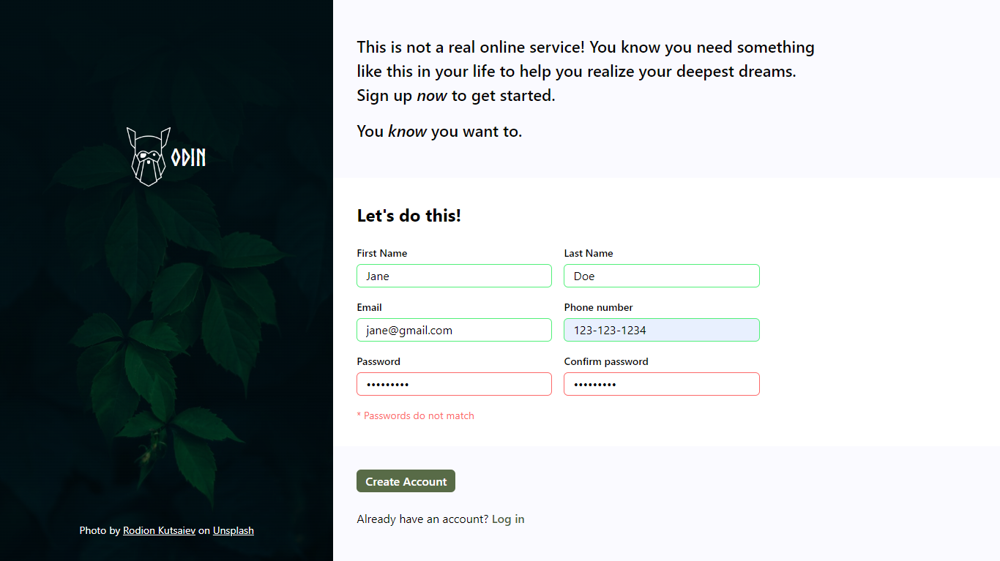
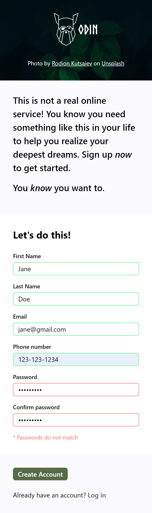

### Sign-up Form

This is a solution to The Odin Project's [Sign-up Form Project](https://www.theodinproject.com/lessons/node-path-intermediate-html-and-css-sign-up-form). It aims to practice the fundamentals of HTML and CSS, as well as explore some basic built-in HTML validations.

[View demo](#view-demo)
•
[Screenshots](#screenshots)
•
[Built with](#built-with)

#### View demo

[Click here to see the live demo of this project on GitHub Pages.](https://jsklcodes.github.io/sign-up-form)

#### Screenshots

Sign-up Form Desktop

&nbsp;

Sign-up Form Mobile

#### Built with

- CSS custom properties
- Flexbox
- CSS Grid
- Mobile-first workflow
- Basic built-in HTML validations
- Client-side validation
- Responsive design
